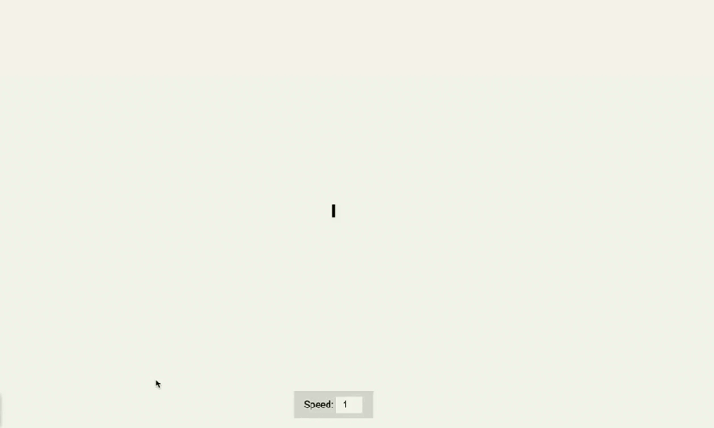

# Auto Text Effect 🔥

Auto Text Effect is a simple HTML, CSS, and JavaScript project that allows users to witness a captivating text being automatically written on the screen. The project incorporates an adjustable speed control feature, enabling users to set the speed of the text animation from 1 to 5 (with 1 being slowest and 5 being fastest).

## Demo

## Getting Started

### Prerequisites

To run the Auto Text Effect project locally, you need the following:

- A modern web browser that supports HTML, CSS, and JavaScript.

## Installation

1. Clone this repository to your local machine or download the ZIP file and extract it.

2. Navigate to the project folder on your local machine.

## Usage

1. Open the index.html file in your web browser.

2. You will see a text box on the screen with a blinking cursor.

3. To start the auto text effect, simply click inside the text box.

4. The text will start to automatically write itself character by character.

5. To control the speed of the animation, use the speed control slider located on the screen. Slide it to the left to slow down the animation (minimum speed) and to the right to speed it up (maximum speed).

6. Experiment with different speeds and enjoy the captivating auto text effect!
